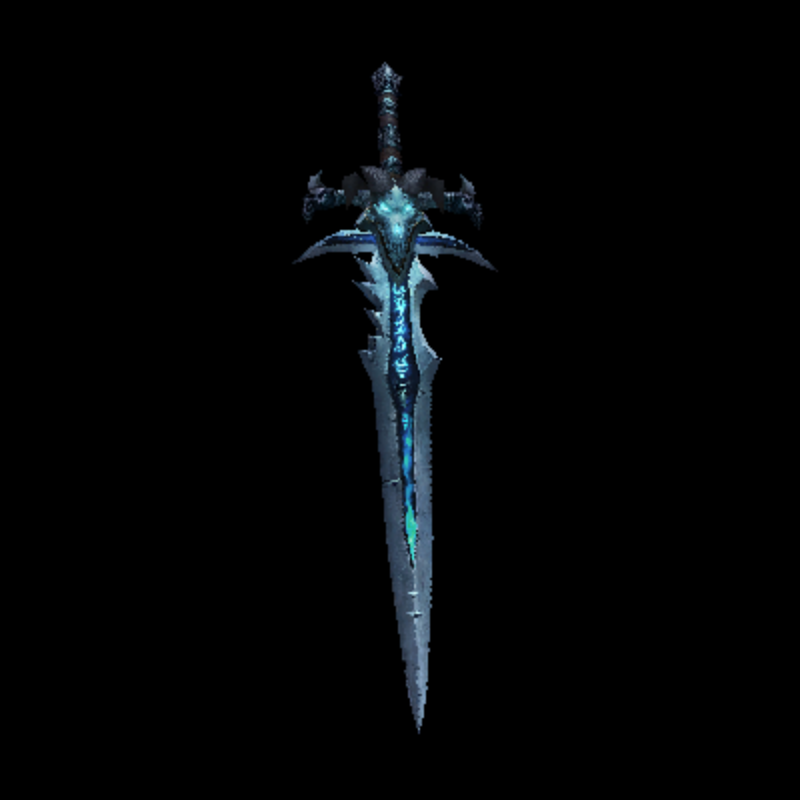

# renderer
 3D Renderer in JavaScript

[Try it now!](https://0olong.github.io/renderer)

## Feature

- Rasterization
- Flat Shading
- UV Mapping
- Z-buffer
- Back-face culling
- Real time renderer config changes

## Screenshots

